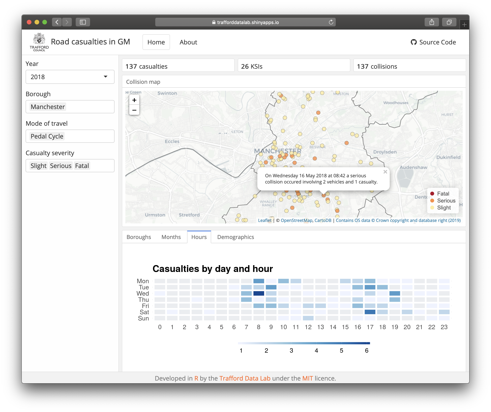

## Road casualties
An <a href="https://cran.r-project.org/" target="_blank">R</a> <a href="https://cran.r-project.org/web/packages/shiny/index.html" target="_blank">Shiny</a> app allowing users to explore road collisions involving personal injury in Greater Manchester. STATS19 road collision data derive from [Transport for Greater Manchester](https://data.gov.uk/dataset/25170a92-0736-4090-baea-bf6add82d118/gm-road-casualty-accidents-full-stats19-data).

<br>



<br />

The app can be viewed at <a href="https://trafforddatalab.shinyapps.io/road_casualties/" target="_blank">https://trafforddatalab.shinyapps.io/road_casualties/</a>

To run the app locally execute the following code:

``` r
shiny::runGitHub("trafforddatalab/road_casualties")
```
